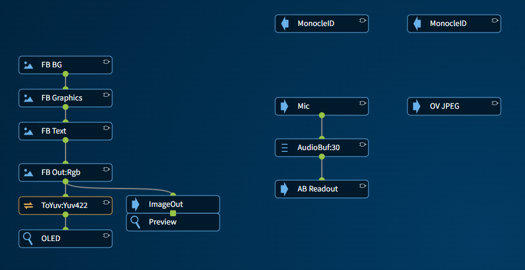

# StreamLogic FPGA Pipeline

This folder contains the StreamLogic source for the Monocle's FPGA pipeline in `pipeline.json`.

## Customization

To customize the pipeline, download the `pipeline.json` file and load it into the StreamLogic tool using the Import -> File menu option.